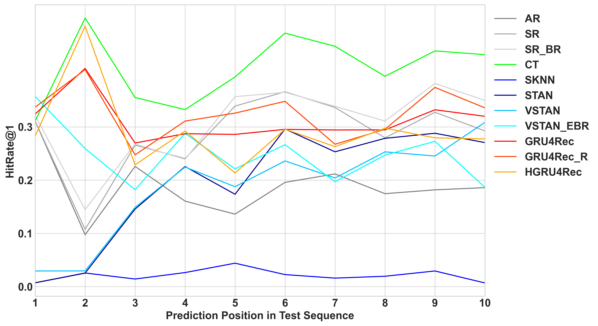
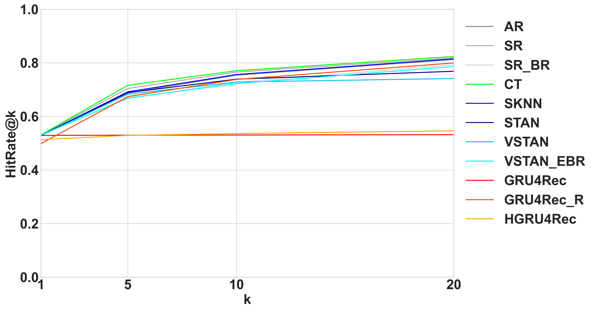

```{r setup, include=FALSE}
knitr::opts_chunk$set(echo = TRUE)
```

# 1 Motivation and Data

## Motivation

- Smartphone usage data becoming a valuable data source
- Most behavioral research: association between smartphone usage patterns and pre-established personality traits
  
Research Idea:

- Model behavioral sequences by means of next-event prediction
- Smartphone usage data from the PhoneStudy project [@phonedata]
- Use natural sequential order (app sessions) in the data:
  - App sessions start by switching on the screen (ON) and end by switching it off (OFF)
  - e.g.: \textit{ON}, \textit{WhatsApp}, \textit{Calendar}, \textit{Safari}, \textit{OFF} 

- Many possible events + sequential data $\rightarrow$ Use sequence-aware recommender system (RS) algorithms

## Data Description

- 310 users, study period from October 29, 2017 through January 22, 2018
- Each app usage assigned exact opening date and time

{width=80% height=60%}

## App-level Representation

- In language modeling:
  - Tokens $\widehat{=}$ words
  - Sentence $\widehat{=}$ sequence of tokens ending with a period
  
- Here:
  - Tokens $\widehat{=}$ apps
  - Sentences $\widehat{=}$ sessions

- Objective: next-app prediction
  - Predicting the next app a user is going to use in a given session

- Mostly very short sessions

## Sequence-level Representation

- How to address the issue of short session length?
- Focus on behavior, not individual apps
  - App-level sessions $:=$ concatenations of app-level \textit{categories}
  - These categories were pre-established by @stachl2020predicting
    - E.g.: "WhatsApp" $\rightarrow$ "Messaging"
    
- Now:
  - Tokens $\widehat{=}$ categorized app-level sessions
  - Sentences $\widehat{=}$ daily concatenations of a user’s sessions
  
- For the sake of unambiguousness: use the terms "event" and "sequence"

## Summary Statistics

{width=100% height=75%}

- Drawback of sequence-level analysis: data size
  - events in sequence-level $\approx$ sequences in app-level

# 2 Modeling

## Definitions and Terminology

- Baseline model $:=$ non-NN-based model
- Session-based model: no incorporation of user-level information (user ID)
- Session-aware model: incorporation of user-level information
- $s_{complete}:=(s_1, s_2, \dots, s_m)$: sequence of chronologically ordered events
  - $s_s$: last "known" event in the sequence
  - $s_{s+1}$: event we seek to predict
  - $s:=(s_1, s_2, \dots, s_s)$: current (known) sequence
- $i$: candidate event for $s_{s+1}$

## Overview of Algorithms

Session-based baseline models:

- Co-occurrence frequency-based models:
  - \textit{AR}, \textit{SR}
  
- Neighborhood-based models:
  - \textit{SKNN}, \textit{STAN}, \textit{VSTAN}
  
- Tree-based models:
  - \textit{CT}

Session-based neural models:

- \textit{GRU4Rec}

Session-aware neural models:

- \textit{HGRU4Rec}

Extension-equipped models:

- \textit{SR\_BR}, \textit{VSTAN\_EBR}, \textit{GRU4Rec\_R}

## Session-based Baseline Models (I)

- \textit{AR} and \textit{SR} [@ludewig2018evaluation]
  - are based on co-occurrence frequencies
  - only take into account $s_s$ when making a prediction
  
- \textit{AR}
  - simply counts co-occurrences of $s_s$ with \textit{any} $i$
  - normalizes this count by the number of all co-occurrences
  
- \textit{SR}
  - accounts for sequential event order
  - only counts co-occurrences where $s_s$ precedes any $i$
  - decreases the weight if other events occurred in-between
  
## Session-based Baseline Models (II)

- The neighborhood-based \textit{SKNN} [@jannach2017recurrent]
  - defines a neighborhood of most similar past sequences
  - determines similarity between $s$ and neighbor sequences
  - computes score as sum of similarity scores across all sequences which contain $i$
  
- \textit{STAN} [@garg2019sequence] and \textit{VSTAN} [@ludewig2021empirical] extend \textit{SKNN}, for instance by
  - accounting for event recency in $s$ using decay functions
  - accounting for sequence recency of neighbor sequences
  
## Session-based Baseline Models (III)

- \textit{CT} by @mi2018context
  - uses a Markov model with context-dependent depth of the Markov chain
  - builds a tree where
    - each node is a set of sequences with a specific suffix (context)
    - each edge combines a parent and child node
  - defines experts as conditional probability of $i$, given a context
  - generates predictions through combination of all experts activated by $s$
  
## Session-based Neural Models

- \textit{GRU4Rec} [@hidasi2015session]
  - initially one-hot encodes single input events
  - feeds input vectors into a Gated Recurrent Unit (GRU) layer
  - uses pairwise ranking losses for training
  - outputs, for each event, the likelihood of being next in the sequence

## Session-aware Neural Models

- \textit{HGRU4Rec} [@quadrana2017personalizing]
  - is a user-aware extension of \textit{GRU4Rec}
  - contains a short- and long-term memory GRU layer
  - generates recommendations for each event in a sequence through a session-level GRU (like \textit{GRU4Rec})
  - updates an additional user-level GRU at the end of each sequence
  - employs its hidden state for initialization of the session-level GRU at the beginning of the next sequence

## Extensions

- We use (a combination of) 3 different heuristics for some session-based algorithms
- Extensions provide user-level information from past sequences $\rightarrow$ session-awareness
1) \textit{Extend} prepends events from the user’s preceding sequence if $s$ is short
2) \textit{Boost} increases the score of $i$ if $i$ has occurred in the user's past sequences
3) \textit{Remind} adds a reminder score to the original model score

## Implementation

- Implementation of models and extensions based on @latifi2021session^[https://github.com/rn5l/session-rec/]
- We perform all modeling, evaluation, and analysis tasks in Python

# 3 Evaluation and Tuning

## Train-Validation-Test Split

- Time-ordered and user-clustered data
- Standard time-agnostic cross-validation not applicable
- Last-event split method, applied twice:
  1) Clip off each user's last sequence $\rightarrow$ test set
  2) Clip off each user's last sequence from the remaining data $\rightarrow$ validation set

- Additionally: split study period into 5 equally long sub-periods (windows)
  - Apply train-validation-test split to all 5 windows
  - Average performance results across all 5 test sets

## Evaluation Protocol and Metrics (I)

- Evaluate predictions for all test sequence events, except the first one
- Ground truth: (only) the actually observed event
- How to choose a performance metric?
  - Quantify the goodness of recommendation lists

## Evaluation Protocol and Metrics (II)

1) Hit Rate (HR): $HR@k$ is simply the fraction of all $n$ events for which the corresponding recommendation list of length $k$, $rl(k)_i$, includes the ground truth, $y_i$:
\begin{align*}
  HR@k &= \frac{\sum_{i=1}^n \mathbbm{1}_{rl(k)_i}(y_i)}{n}
\end{align*}

2) Mean Reciprocal Rank (MRR): $MRR@k$ additionally accounts for the ranking within the recommendation list. $MRR@k$ computes the reciprocal rank of the ground truth within the recommendation list, $rr_i$, then averages this reciprocal rank across all $n$ events:
\begin{align*}
  MRR@k = \frac{\sum_{i=1}^n rr_i}{n}
\end{align*}

- We consider $HR@k$ and $MRR@k$ for $k \in \{1,5,10,20\}$

## Tuning

- Simple random search with budget 100 for each algorithm
- Hyperparameter search spaces as in @latifi2021session
- Tuning on five-window data, then averaging performance to determine optimal hyperparameter configuration
- Tuning metric: $HR@1$

# 4 App-level Results

## Overall Performance

{width=100% height=75%}

- Best performer i.t.o. $HR@1$ and $HR@5$: \textit{CT}
- Best performer i.t.o. $HR@10$ and $HR@20$: \textit{VSTAN\_EBR}
- Strong $HR@1$ performance of NN-based models

## Minimum Sequence Length (I)

- Background: 
  - \textit{GRU4Rec}, \textit{GRU4Rec\_R}, and \textit{HGRU4Rec} employ RNNs, which learn from the present sequence
  - App-level sequences are typically short $\rightarrow$ RNN-based methods do not have "much to learn from"
  - Co-occurrence frequency-based models simply "look up" co-occurrences with the last known event

- Hypotheses:
  - Better performance of NN-based models on longer sequences
  - No impact of sequence length on performance of \textit{AR}, \textit{SR}, and \textit{SR\_BR}

$\rightarrow$ Train and evaluate our models on a subset containing only sequences with at least 20 events

## Minimum Sequence Length (II)

{width=100% height=75%}

- \textit{CT} still best performer for $HR@1$ and $HR@5$
- No large changes for \textit{AR}, \textit{SR}, and \textit{SR\_BR}
- Performance of NN-based models improves

## Minimum Sequence Length (III)

- What if instead we train on all sequences and only evaluate on long sequences?
  - \textit{CT} still best performer
  - All neural models perform considerably worse
  - Surprising because the full training dataset is considerably larger
- Conclusion: performance on long sequences benefits from training on long sequences only

## Position in Test Sequence (I)

{width=100% height=75%}

- Initial performance boost for \textit{VSTAN\_EBR}
- No clear trend for all other models

## Position in Test Sequence (II)

\begin{table}
\centering
\resizebox{.55\width}{!}{\input{../tables/results_app_multiple_cutoff_HR@1}}
\caption{\tiny Table 3: $HR@1$ performance results on five-window app-level data, by positional cutoff within test sequence.}
\end{table}

- Worse performance for NN-based models on later positions
- If training is not tailored towards them: NN-based models struggle with later positions in the prediction sequences and, consequently, with long prediction sequences

## Removing ON and OFF Events (I)

- Key issue and potential performance bottleneck: short sequence length
- ON and OFF events are hardly informative
- ON-OFF sequences make up $38.91\%$ of all app-level sequences
- Effect of dropping all ON and OFF events from the app-level data?

## Removing ON and OFF Events (II)

{width=100% height=75%}

- Improvements i.t.o. $HR@1$ across the board
- Substantial improvements for neighborhood-based models
- Drawback: limited representativeness of results

## Category-level Prediction (I)

- Ultimate goal: predict human behavioral sequences $\rightarrow$ consider next-category prediction instead of next-app prediction
- For evaluation, simply consider app category: e.g., "Messaging" instead of "WhatsApp"
- If performance improves considerably: models learn more about behavioral sequences than previously thought

## Category-level Prediction (II)

\vspace{-0.3cm}
{width=100% height=75%}

- Performance increases especially for larger $k$, more pronounced for NN-based methods, and proportional to app-level performance

## Embedding Analysis (I)

- Can deep learning models learn smartphone app semantics?
- Do apps from a common app category form clusters in the embedding space?
$\rightarrow$ Add an embedding layer ($d=128$) to \textit{GRU4Rec}
- Apply TSNE [@hinton2002stochastic] to obtain two-dimensional app embeddings

## Embedding Analysis (II)

\vspace{-0.3cm}
{width=75% height=75%}

- No category-level clustering recognizable
- Only for $11.67\%$ of apps their most similar app (i.t.o. cosine similarity) is from the same category

## Embedding Analysis (III)

- Alternatively: start off with data-driven clustering approach k-means
- Look at potential accumulations of app categories within each cluster

## Embedding Analysis (IV)

\vspace{-0.5cm}
{width=75% height=75%}

- Moccasin-colored cluster: 32 out of 52 apps (>60\%) are camera or image editing apps
- However: vast majority of clusters dispersed across app space, with little intra-cluster app category clustering.

## Embedding Analysis (V)

- Experimentally construct app analogies such as "Messaging 1 - Social Network 1 + Social Networks 2 = ???"
- We find no meaningful app analogies in our embeddings:
  - App analogies conceptually much less intuitive than word analogies
  - Low overall quality of \textit{GRU4Rec} embeddings

# 5 Sequence-level Results

## Overall Performance

{width=100% height=75%}

- Strong $HR@1$ performance by all algorithms
- Low performance increases with increasing $k$
- \textit{GRU4Rec} and \textit{HGRU4Rec} weakest performers for $k>1$

## Removing ON-OFF Tokens (I)

- Suspiciously high $HR@1$ performance across all algorithms
- High prevalence of ON-OFF tokens ($51.06\%$)
- All algorithms predict ON-OFF tokens (almost) everywhere
  - Predictive performance on other tokens ~$0\%$
- Effect of removing ON and OFF events from underlying app-level data?

## Removing ON-OFF Tokens (II)

{width=100% height=75%}

- Performance drops for all algorithms, especially i.t.o. $HR@1$
- \textit{CT} best, \textit{GRU4Rec} and \textit{HGRU4Rec} worst performers

## Position in Test Sequence (I)

{width=100% height=75%}

- ON and OFF events removed from the underlying app-level data
- No clear trend for any of the models

## Position in Test Sequence (II)

\begin{table}
\centering
\resizebox{.55\width}{!}{\input{../tables/results_seq_multiple_cutoff_HR@1}}
\caption{\tiny Table 4: $HR@1$ performance results on five-window sequence-level data, by positional cutoff within test sequence.}
\end{table}

- All models except \textit{SKNN} perform better on later positions of the test sequences
- The precise positioning of the cutoff not very relevant

## Position in Test Sequence (III)

- For NN-based models: performance improvement for later events in line with expectations
- Comparison app- versus sequence-level data:
  - App-level setting: predominantly short sequences
  - Sequence-level setting: mostly long sequences
- Corroborates our previous conclusion: training on short and evaluating on long sequences negatively affects the performance of NN-based algorithms

# 6 Discussion

## Conclusion (I)

- By and large, strong predictive performance of most algorithms
- NN-based models mostly perform well i.t.o. $HR@1$ and $HR@5$
  - Amongst them, \textit{HGRU4Rec} is often the weakest one
- NN-based model performance is prone to sequence length and data size
- NN-based models are very expensive i.t.o. runtime and computational effort
- Baseline models are the preferable modeling choice for our data

## Conclusion (II)

- \textit{CT} recommendable i.t.o. $HR@1$ and $HR@5$, no tuning
- \textit{SR} exhibits strong performance i.t.o. $HR@10$ and $HR@20$, fast

- No overarching user-level effects in our data
  - For predicting future behavioral sequences of a particular user, not overly helpful to know this particular person's past smartphone usage patterns
  
- User-level extensions mostly effective, especially for short sequences and early positions
  - not due to some profound user-level learning
  - instead, addressing technical weaknesses
  - e.g., \textit{VSTAN\_EBR} alleviates poor early-position performance of other neighborhood-based models stemming from low informational content in short sequences

## Limitations

- Dataset size: potentially giving a relative advantage to non-neural methods
- Algorithm selection: not including some of the modern sophisticated approaches, e.g., \textit{BERT4Rec} [@sun2019bert4rec]
  - Attention-based models require even more training data
  - Their main advantage is the better handling of \textit{long-term} dependencies while we mostly have \textit{short} sequences

## Suggestions for Future Research

- Increased dataset size: new PhoneStudy dataset $\rightarrow$ Investigate impact of data size on (NN-based) model performance
- Information extraction: incorporation of duration, exact daytime, and geolocation of app usage
- Transfer learning: use of pre-trained transformers?

##

\center \large \textbf{Thank you for your attention!}

# 7 References

## References {.allowframebreaks}