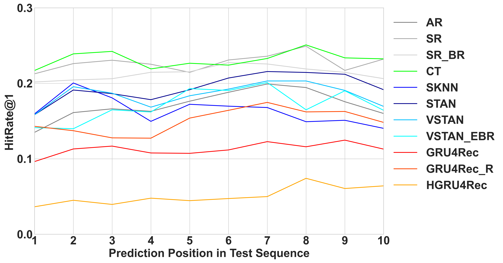

```{r setup, include=FALSE}
knitr::opts_chunk$set(echo = TRUE)
```

# 1 Introduction

# 2 Theoretical Framework

- early works (big 5)
- uncouple from psych context: app2vec
  - app analogies not very intuitive (example)
  - how to evaluate performance?
- uncouple from psych context, focus exclusively on sequential nature of data
  - time-ordered sequences, imposing session structure
  - similarity to data from movie ratings, e-commerce sessions, social networking sites:
    - several users
    - 1+ sessions per user
    - 1+ events per session
  - use RS models
    - target variable follows a multinomial distribution with a large number of distinct outcomes
    - task is to create a recommendation list
- intrinsic similarity to language data
- session-based and session-aware RS  

# 3 Data

- description (+ table)
- representation  and preprocessing: app-level 
- representation  and preprocessing: sequence-level
- representation  and preprocessing: app-to-text conversion

# 4 Methodology

- modeling
  - session-based baseline models
  - session-based neural models
  - session-aware neural models
  - extensions
- evaluation
  - train-validation-test split
  - evaluation protocol
  - evaluation metrics
  - tuning

# 5 App-level Results

## Overall Performance

{width=100% height=75%}

- Best performer i.t.o. $HR@1$ and $HR@5$: \textit{CT}
- Best performer i.t.o. $HR@10$ and $HR@20$: \textit{VSTAN\_EBR}
- Strong $HR@1$ performance of NN-based models

## Minimum Sequence Length (I)

- Background: 
  - \textit{GRU4Rec}, \textit{GRU4Rec\_R}, and \textit{HGRU4Rec} employ RNNs
  - These learn from the present sequence whereas non-neural methods mostly "look up" similar sequences or app combinations
  - App-level sequences are typically short $\rightarrow$ RNN-based methods do not have "much to learn from"

- Hypotheses:
  - Better performance of NN-based models on longer sequences
  - No impact of sequence length on performance of \textit{AR}, \textit{SR}, and \textit{SR\_BR}

$\rightarrow$ Train and evaluate our models on a subset containing only sequences with at least 20 events.

## Minimum Sequence Length (II)

{width=100% height=75%}

- \textit{CT} still best performer for $HR@1$ and $HR@5$
- No large changes for \textit{AR}, \textit{SR}, and \textit{SR\_BR}
- Performance of NN-based models improves

## Minimum Sequence Length (III)

- What if instead we train on all sequences and only evaluate on long sequences?
  - \textit{CT} still best performer
  - All neural models perform considerably worse
  - Surprising because the full training dataset is considerably larger
- Conclusion: performance on long sequences benefits from training on long sequences only

## Position in Test Sequence (I)

{width=100% height=75%}

- Initial performance boost for \textit{VSTAN\_EBR}
- No clear trend for all other models

## Position in Test Sequence (II)

\begin{table}
\centering
\resizebox{.55\width}{!}{\input{../tables/results_app_multiple_cutoff_HR@1}}
\caption{\tiny Table XXX: $HR@1$ performance results on five-window app-level data, by positional cutoff within test sequence.}
\end{table}

- Worse performance for NN-based models on later positions
- if training is not tailored towards them: NN-based models struggle with later positions in the prediction sequences and, consequently, with long prediction sequences

## Removing ON and OFF Events (I)

- Key issue and potential performance bottleneck: short sequence length
- ON and OFF events are hardly informative
- ON-OFF sequences make up $38.91\%$ of all app-level sequences
- Effect of dropping all ON and OFF events from the app-level data?

## Removing ON and OFF Events (II)

\vspace{-0.5cm}
{width=100% height=75%}

## App-level Results
### Removing ON and OFF Events (III)

- Dropping ON and OFF events increases performance, especially for the top-ranked recommendation ($HR@1$).
- Substantial performance increase for the nearest neighbor-based models \textit{SKNN} and \textit{STAN}.
  - These models do not have any user-level heuristics.
  - Since the first event of all app-level sequences is a (non-informative) ON event, it is very hard for these models to find similar sequences based on such unspecific information.
- Drawback:
  - Model performance now reflects the models' capability to predict behavioral sequences \textit{conditional} upon the sequence not being an ON-OFF sequence and upon the next event being neither an ON nor an OFF event.
  - In our case, dropping ON and OFF events leads to the exclusion of 49.92\% of all app-level sequences.
  - This conditional analysis is hardly representative of overall user behavior anymore.

## Category-level Prediction (I)

- Ultimate goal: predict human behavioral sequences $\rightarrow$ consider next-category prediction instead of next-app prediction.
- For evaluation, we thus simply consider the app category: for instance, "messaging" instead of "WhatsApp".
- If performance improves considerably: our models actually learn more about behavioral sequences than previously thought.

## Category-level Prediction (II)

\vspace{-0.5cm}
{width=100% height=75%}

## Category-level Prediction (III)

- Performance increases for non-neural methods: small for $k=1$, noticeable for larger $k$.
- Performance increases for neural methods: more pronounced, especially for larger $k$.
- In general: performance increases are proportional to standard app-level performance.
- Conclusions:
  - Next-app prediction performance is largely indicative of how much the algorithms truly learn in terms of behavioral sequence modeling.

## Embedding Analysis (I)

- Can deep learning models learn smartphone app semantics?
- Do apps from a common app category form clusters in the embedding space?
- We add an embedding layer ($d=128$) to the otherwise fully tuned \textit{GRU4Rec} model and extract it after training.
- Then, we apply the t-distributed stochastic neighbor embedding (TSNE) dimensionality reduction technique [@hinton2002stochastic] to obtain two-dimensional app embeddings.

## Embedding Analysis (II)

\vspace{-0.5cm}
{width=75% height=75%}

## Embedding Analysis (III)

- No apparent category-level clustering is recognizable.
- In numbers: only for $11.67\%$ of apps their most similar app (i.t.o. cosine similarity) is from the same category.
- App embeddings learned by the \textit{GRU4Rec} model are not very successful at learning true app-level semantics.

## Embedding Analysis (IV)

- Alternatively, we might want to start off with a data-driven clustering approach, based on positioning within the embedding space.
- We use k-means clustering on the untransformed 128-dimensional app embeddings ($k=15$).
- Then we look at potential accumulations of app categories within each one of the 15 clusters.

## Embedding Analysis (V)

\vspace{-0.5cm}
{width=75% height=75%}

## Embedding Analysis (VI)

- Moccasin-colored cluster (center top): high prevalence of apps from only few but related categories:
  - 32 out of a total 52 apps (i.e., more than 60\%) are either camera or image editing apps.
- However, the vast majority of clusters are very much dispersed across the app space, with few to no intra-cluster app category clustering.

## Embedding Analysis (VII)

- Finally, we briefly consider app analogies.
- We experimentally construct app analogies such as "Messaging 1 + Social Network 1 - Social Networks 2 = ???".
- We find no meaningful app analogies in our embeddings:
  - App analogies are conceptually much less intuitive than word embeddings.
  - The overall quality of our \textit{GRU4Rec} embeddings is rather low, just like the degree of clustering amongst apps from the same category.
- Altogether:
  - Next-app prediction is possible and informative given our app-level data $\rightarrow$ the algorithms do learn behavioral patterns based on app usage data.
  - This learning is not profound enough as for app semantics to be recognizable.

# 6 Sequence-level Results

## Overall Performance (I)

\vspace{-0.5cm}
{width=100% height=75%}

## Overall Performance (II)

- All algorithms show a strong performance in terms of $HR@1$, at around $50\%$.
- Performance increases with increasing $k$ are much lower than in the app-level setting $\rightarrow$ $HR@20$ performance worse than in the app-level case for 7 algorithms.
- As in the app-level setting: \textit{CT} is the best performer.
- \textit{GRU4Rec} and \textit{HGRU4Rec} are the weakest performers for all metrics where $k \ge 5$.
  - Surprising since sequence-level sequences are mostly rather long
- \textit{CT} covers $95\%$ of all tokens, while \textit{GRU4Rec} only covers $8\%$.
- Popularity bias is rather low (between $5\%$ and $8\%$) for all models.

## Removing ON-OFF Tokens (I)

- The high $HR@1$ performance across all algorithms is suspicious.
- It might simply be the consequence of the high prevalence of ON-OFF tokens ($51.06\%$).
- Removing all ON and OFF events from the underlying app-level data translates into removing all ON-OFF tokens from the sequence-level data.

## Removing ON-OFF Tokens (II)

\vspace{-0.5cm}
{width=100% height=75%}

## Removing ON-OFF Tokens (III)

- Performance drops for all algorithms after excluding ON-OFF tokens, especially i.t.o. $HR@1$.
- Average performance drop (across all algorithms): $63.88\%$.
- \textit{CT} is still the best performer, \textit{GRU4Rec} and \textit{HGRU4Rec} are the worst performers for all metrics.
- On the unrestricted data, 10 out of 11 algorithms predict an ON-OFF token as top ranked recommendation in more than $95\%$ of all cases.
  - As a consequence, $HR@1$ on non-ON-OFF events is close to 0 for all algorithms.

## Position in Test Sequence (I)

\vspace{-0.5cm}
{width=100% height=75%}

## Position in Test Sequence (II)

- We use sequence-level data with all ON and OFF events removed from the underlying app-level data.
- We do not see a clear trend for any of the models as the position of the event within the test sequence increases.
- Performance for the first position is relatively weak for all algorithms.
- Again, we introduce a cutoff after the 2nd, 5th, or 10th event to be predicted and compare pre- and post-cutoff performance

## Position in Test Sequence (III)

\begin{table}
\centering
\resizebox{.55\width}{!}{\input{../tables/results_seq_multiple_cutoff_HR@1}}
\caption{\tiny Table XXX: $HR@1$ performance results on five-window sequence-level data, by positional cutoff within test sequence.}
\end{table}

- All models except \textit{SKNN} perform better on later positions of the test sequences
- The precise positioning of the cutoff is not decisive.

## Position in Test Sequence (IV)

- For NN-based models, this performance improvement for later events is in line with what we expected.
- Difference in performance across positions for app- versus sequence-level data:
  - App-level setting: predominantly short sequences.
  - Sequence-level setting: mostly long sequences.
- This corroborates our previous conclusion: differences in sequence lengths between training and evaluation data negatively affect the performance of NN-based algorithms.

# Discussion

## Conclusion

## Limitations

## Suggestions for Future Research


# 6 References {.allowframebreaks}
## 