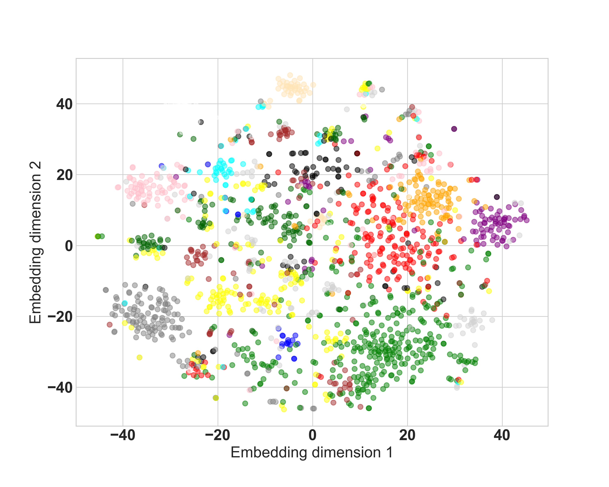

```{r setup, include=FALSE}
knitr::opts_chunk$set(echo = TRUE)
```

# 1 Motivation

## Introduction

- Smartphone usage has been becoming a valuable source of data in recent years:
  - large volume
  - ubiquitous
  - easily accessible
  - clean
  - representative of actual human behavior
  
- Behavioral researchers: investigating human behavioral traits through smartphone usage
- Most behavioral research: association between smartphone usage patterns and pre-established personality traits
- Here: data-centric approach to the modeling of human behavioral sequences
  
## Research Idea

- Smartphone usage data from a PhoneStudy project [@phonedata]
  
- There is a natural sequential order in the data:
  - An app session starts by switching on the screen and ends by switching it off
  - The apps used in between, ordered by their timestamps, as well as the ON and OFF tokens form the events of an app session

- Model behavioral sequences by means of next-event prediction
- Large number of possible events + sequential data $\rightarrow$ Use sequence-aware recommender system (RS) algorithms

# 2 Data

## Description

We use the PhoneStudy dataset from a mobile sensing research project at the Ludwig-Maximilians-University Munich (\citealp{phonedata}). The dataset is composed of three individual studies, yet we only use data from the first one since it accounts for almost 95\% of all observations. As part of the study, 310 participants (users) were recruited, consenting to providing log, sensor, and app-usage data during the study period from October 29, 2017 through January 22, 2018.

For each user, we have up to 86 days of smartphone usage data, each app usage being assigned the exact opening date and time. In a first preprocessing step, we define smartphone usage sessions as a time-ordered sequence of events starting with an ON event (whereby the screen is switched on) and ending with an OFF event (whereby the screen is switched off). All events within a single session are assigned the same unique session ID. By definition, each session has minimum length two; sessions with a length of exactly two are ON-OFF sessions, where a user turns on the screen (for example to check the time) and turns it off immediately after.

As a final general preprocessing step, we map app names to numeric app IDs and convert the date and time variable to a Unix timestamp, resulting in the dataframe as shown in Table \ref{Tab:dataframe}. There is a total of 844,296 sessions, with 1392 and 1389 being the IDs corresponding to an ON and OFF event, respectively.


- description (+ table)
- representation  and preprocessing: app-level 
- representation  and preprocessing: sequence-level
- representation  and preprocessing: app-to-text conversion

# 3 Methodology

- modeling
  - session-based baseline models
  - session-based neural models
  - session-aware neural models
  - extensions
- evaluation
  - train-validation-test split
  - evaluation protocol
  - evaluation metrics
  - tuning

# 4 App-level Results

## Overall Performance

{width=100% height=75%}

- Best performer i.t.o. $HR@1$ and $HR@5$: \textit{CT}
- Best performer i.t.o. $HR@10$ and $HR@20$: \textit{VSTAN\_EBR}
- Strong $HR@1$ performance of NN-based models

## Minimum Sequence Length (I)

- Background: 
  - \textit{GRU4Rec}, \textit{GRU4Rec\_R}, and \textit{HGRU4Rec} employ RNNs
  - These learn from the present sequence whereas non-neural methods mostly "look up" similar sequences or app combinations
  - App-level sequences are typically short $\rightarrow$ RNN-based methods do not have "much to learn from"

- Hypotheses:
  - Better performance of NN-based models on longer sequences
  - No impact of sequence length on performance of \textit{AR}, \textit{SR}, and \textit{SR\_BR}

$\rightarrow$ Train and evaluate our models on a subset containing only sequences with at least 20 events.

## Minimum Sequence Length (II)

{width=100% height=75%}

- \textit{CT} still best performer for $HR@1$ and $HR@5$
- No large changes for \textit{AR}, \textit{SR}, and \textit{SR\_BR}
- Performance of NN-based models improves

## Minimum Sequence Length (III)

- What if instead we train on all sequences and only evaluate on long sequences?
  - \textit{CT} still best performer
  - All neural models perform considerably worse
  - Surprising because the full training dataset is considerably larger
- Conclusion: performance on long sequences benefits from training on long sequences only

## Position in Test Sequence (I)

{width=100% height=75%}

- Initial performance boost for \textit{VSTAN\_EBR}
- No clear trend for all other models

## Position in Test Sequence (II)

\begin{table}
\centering
\resizebox{.55\width}{!}{\input{../tables/results_app_multiple_cutoff_HR@1}}
\caption{\tiny Table XXX: $HR@1$ performance results on five-window app-level data, by positional cutoff within test sequence.}
\end{table}

- Worse performance for NN-based models on later positions
- if training is not tailored towards them: NN-based models struggle with later positions in the prediction sequences and, consequently, with long prediction sequences

## Removing ON and OFF Events (I)

- Key issue and potential performance bottleneck: short sequence length
- ON and OFF events are hardly informative
- ON-OFF sequences make up $38.91\%$ of all app-level sequences
- Effect of dropping all ON and OFF events from the app-level data?

## Removing ON and OFF Events (II)

{width=100% height=75%}

- Improvements i.t.o. $HR@1$ across the board
- Substantial improvements for neighborhood-based models
- Drawback: limited representativeness of results

## Category-level Prediction (I)

- Ultimate goal: predict human behavioral sequences $\rightarrow$ consider next-category prediction instead of next-app prediction.
- For evaluation, simply consider app category: e.g., "messaging" instead of "WhatsApp".
- If performance improves considerably: models learn more about behavioral sequences than previously thought

## Category-level Prediction (II)

\vspace{-0.3cm}
{width=100% height=75%}

- Performance increases especially for larger $k$, more pronounced for NN-based methods, and proportional to app-level performance

## Embedding Analysis (I)

- Can deep learning models learn smartphone app semantics?
- Do apps from a common app category form clusters in the embedding space?
$\rightarrow$ Add an embedding layer ($d=128$) to \textit{GRU4Rec}
- Apply TSNE [@hinton2002stochastic] to obtain two-dimensional app embeddings

## Embedding Analysis (II)

\vspace{-0.3cm}
{width=75% height=75%}

- No category-level clustering recognizable
- Only for $11.67\%$ of apps their most similar app (i.t.o. cosine similarity) is from the same category

## Embedding Analysis (III)

- Alternatively: start off with data-driven clustering approach k-means
- Look at potential accumulations of app categories within each cluster

## Embedding Analysis (IV)

\vspace{-0.5cm}
{width=75% height=75%}

- Moccasin-colored cluster: 32 out of 52 apps (>60\%) are camera or image editing apps
- However: vast majority of clusters dispersed across app space, with little intra-cluster app category clustering.

## Embedding Analysis (V)

- Experimentally construct app analogies such as "Messaging 1 + Social Network 1 - Social Networks 2 = ???".
- We find no meaningful app analogies in our embeddings:
  - App analogies conceptually much less intuitive than word embeddings
  - Low overall quality of \textit{GRU4Rec} embeddings

# 5 Sequence-level Results

## Overall Performance

{width=100% height=75%}

- Strong $HR@1$ performance by all algorithms
- Low performance increases with increasing $k$
- \textit{GRU4Rec} and \textit{HGRU4Rec} weakest performers for $k>1$

## Removing ON-OFF Tokens (I)

- Suspiciously high $HR@1$ performance across all algorithms
- High prevalence of ON-OFF tokens ($51.06\%$)
- All algorithms predict ON-OFF tokens (almost) everywhere
  - Predictive performance on other tokens ~$0\%$
- Effect of removing ON and OFF events from underlying app-level data?

## Removing ON-OFF Tokens (II)

{width=100% height=75%}

- Performance drops for all algorithms, especially i.t.o. $HR@1$
- \textit{CT} best, \textit{GRU4Rec} and \textit{HGRU4Rec} worst performers

## Position in Test Sequence (I)

{width=100% height=75%}

- ON and OFF events removed from the underlying app-level data
- No clear trend for any of the models

## Position in Test Sequence (II)

\begin{table}
\centering
\resizebox{.55\width}{!}{\input{../tables/results_seq_multiple_cutoff_HR@1}}
\caption{\tiny Table XXX: $HR@1$ performance results on five-window sequence-level data, by positional cutoff within test sequence.}
\end{table}

- All models except \textit{SKNN} perform better on later positions of the test sequences
- The precise positioning of the cutoff not very relevant

## Position in Test Sequence (III)

- For NN-based models: performance improvement for later events in line with expectations
- Comparison app- versus sequence-level data:
  - App-level setting: predominantly short sequences
  - Sequence-level setting: mostly long sequences
- Corroborates our previous conclusion: differences in sequence lengths between training and evaluation data negatively affect the performance of NN-based algorithms.

# 6 Discussion

## Conclusion (I)

- By and large, strong predictive performance of most algorithms
- NN-based models mostly perform well i.t.o. $HR@1$ and $HR@5$
  - Amongst them, \textit{HGRU4Rec} is often the weakest one
- NN-based model performance is prone to sequence length and data size
- NN-based models are very expensive i.t.o. runtime and computational effort
- Simple, non-NN models are the preferable modeling choice for our data

## Conclusion (II)

- \textit{CT} recommendable i.t.o. $HR@1$ and $HR@5$, no tuning
- \textit{SR} exhibits strong performance i.t.o. $HR@10$ and $HR@20$, fast

- No overarching user-level effects in our data
  - For predicting future behavioral sequences of a particular user, not overly helpful to know this particular person's past smartphone usage patterns
  
- User-level extensions mostly effective, especially for short sequences and early positions
  - not due to some profound user-level learning
  - instead, addressing technical weaknesses of the session-based baseline algorithm
  - e.g., \textit{VSTAN\_EBR} alleviates poor early-position performance of other neighborhood-based models stemming from low informational content in short sequences

## Limitations

- Dataset size: potentially giving a relative advantage to non-neural methods
- Algorithm selection: not including some of the modern sophisticated approaches, e.g., \textit{BERT4Rec} [@sun2019bert4rec]
  - Attention-based models require even more training data
  - Their main advantage is the better handling of \textit{long-term} dependencies while we mostly have \textit{short} sequences

## Suggestions for Future Research

- Increased dataset size: new PhoneStudy dataset $\rightarrow$ Investigate impact of data size on (NN-based) model performance
- Information extraction: incorporation of duration, exact daytime, and geolocation of app usage
- Transfer learning: use of pre-trained transformers?


# 8 References {.allowframebreaks}
## 